# Medicare

## Overview

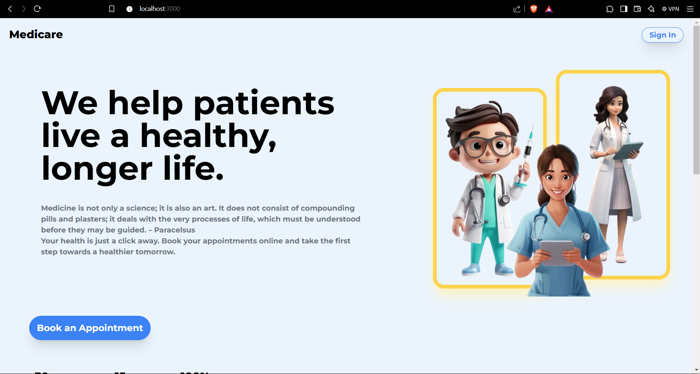

The Medicare Web App is a platform designed to connect patients with doctors through a seamless, user-friendly interface. It allows users to book appointments and have  consultations with doctors from various specialties, providing a convenient and efficient way to access healthcare.

## Features

- **User Authentication**: Secure sign-up and login using Google Authentication for both doctors and patients.
- **Doctor Profiles**: Detailed profiles for doctors, including their specialties, experience, and availability.
- **Appointment Booking**: Users can easily book appointments with available doctors.
- **Appointment Management**: Both patients and doctors can view and manage their upcoming appointments.
- **Responsive Design**: Optimized for both desktop and mobile devices.

## Screenshots

**Doctor Search**

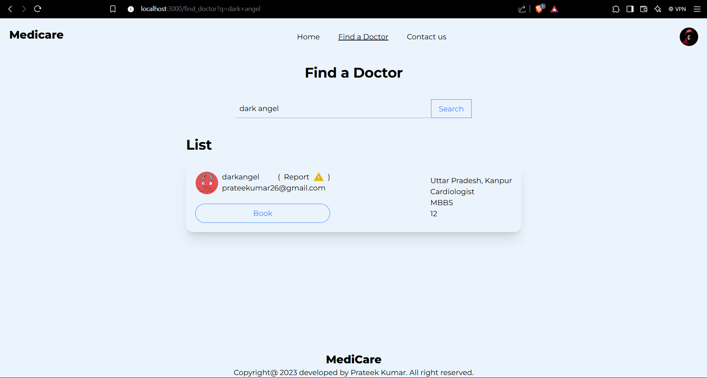

**Admin**

*Admin Dashboard*
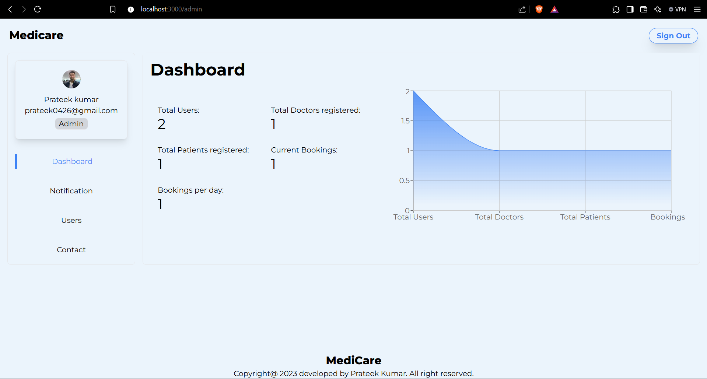

*Admin Notifications*
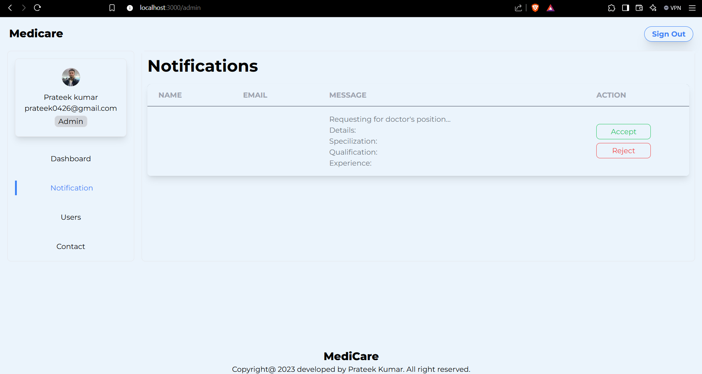

*Admin Control*
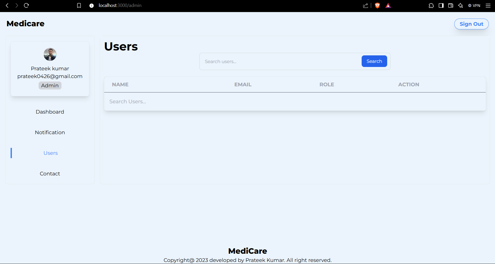

*Admin Messages*
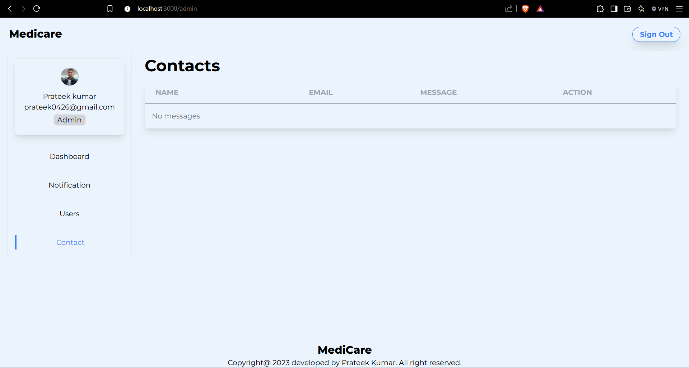

**User**

*User Profile*
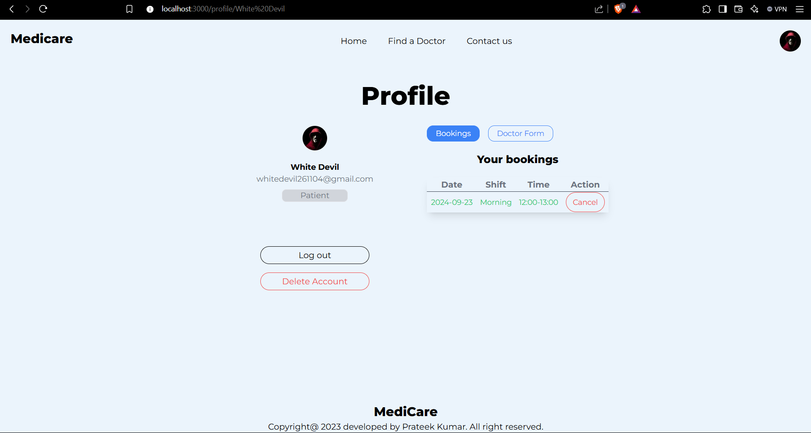

**Doctor**

*Doctor Profile*
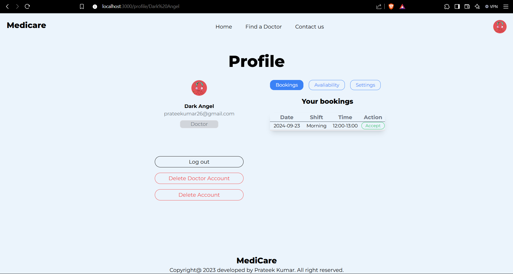

*Doctor Avaliability*
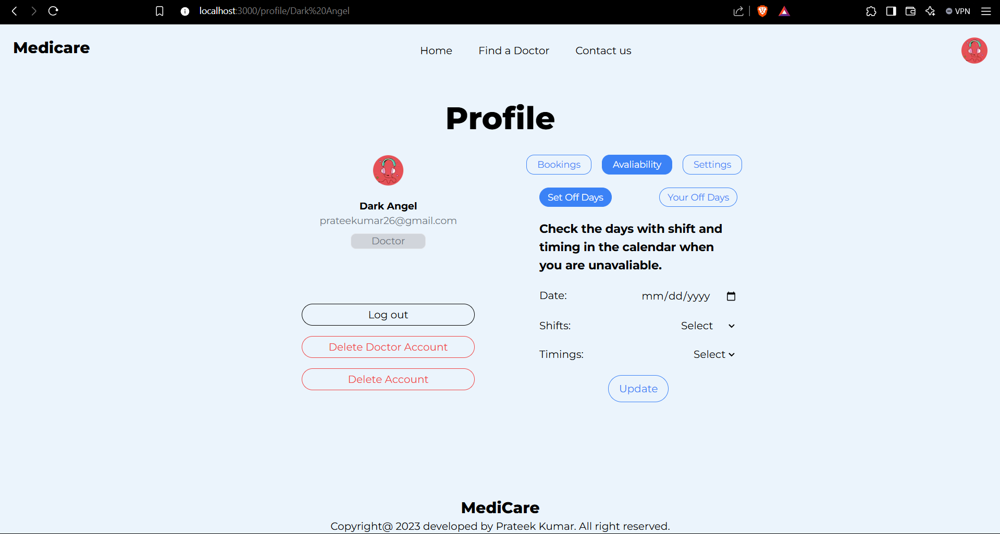
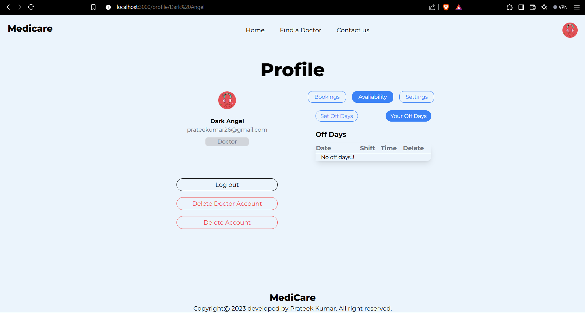

*Doctor Settings*
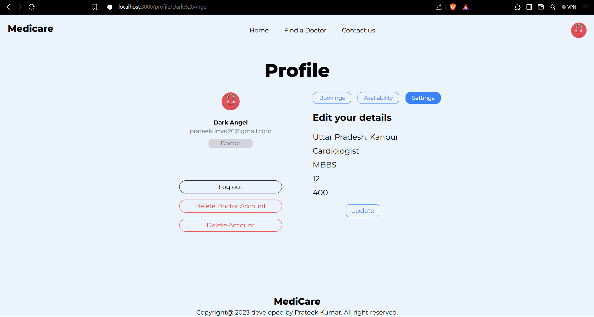

## Technologies Used

- **Frontend**: 
  - HTML, CSS, JavaScript
  - Next.js for building the user interface
- **Backend**: 
  - Next.js API Routes for server-side logic
  - MongoDB for database management
- **Authentication**: 
  - NextAuth.js for handling Google Authentication

## Installation

### Prerequisites
- Node.js and npm installed on your local machine
- MongoDB installed or access to a MongoDB Atlas cluster

### Steps
1. **Clone the Repository:**
    ```bash
    git clone https://github.com/pratee-k-umar/Medicare.git
    ```
2. **Navigate to the Project Directory:**
    ```bash
    cd client
    ```
3. **Install Dependencies:**
    ```bash
    npm install
    ```
4. **Set Up Environment Variables:**
    - Create a `.env` file in the root directory.
    - Add your MongoDB connection string, NEXTAUTH_SECRET, GOOGLE_ID, GOOGLE_SECRET, NEXTAUTH_URL, and any other required environment variables.

5. **Start the Development Server:**
    ```bash
    npm run dev
    ```
6. **Open Your Browser:**
    - Navigate to `http://localhost:3000` to see the application in action.

## Usage

1. **User Registration:** Sign up as a doctor or patient.
2. **Profile Setup:** Doctors can set up their profiles, including availability for consultations.
3. **Book an Appointment:** Patients can browse doctor profiles and book appointments based on their availability.
4. **Consultation:** At the scheduled time, both the doctor and patient can join the consultation through the platform.
5. **Manage Appointments:** View and manage upcoming appointments from the dashboard.

## Contributing

We welcome contributions! Please fork the repository and create a pull request with your changes. For major changes, please open an issue to discuss what you would like to change.

## Contact

For any questions or suggestions, feel free to contact Me at [prateek0426@gmail.com].
